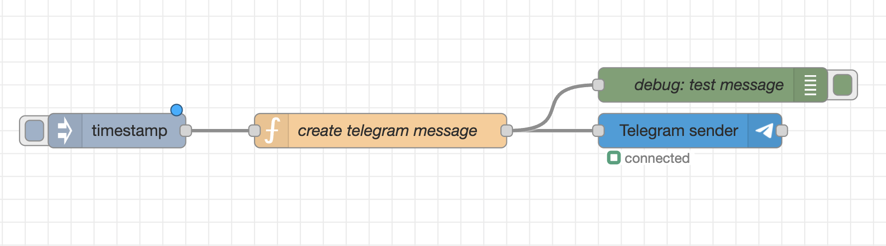
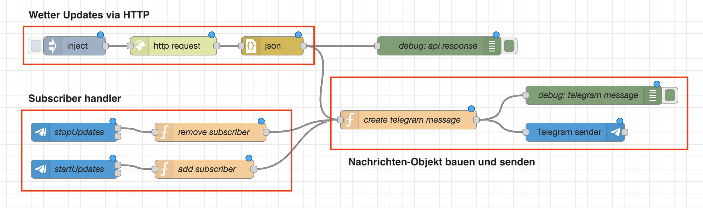
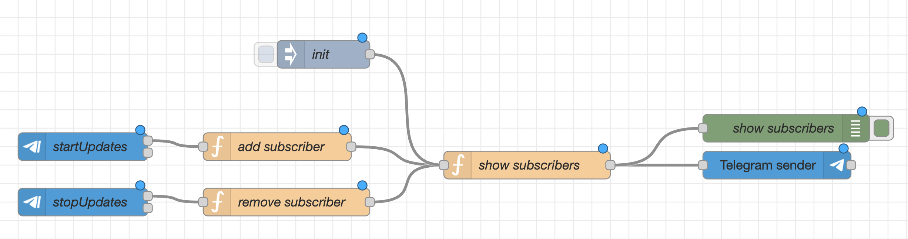
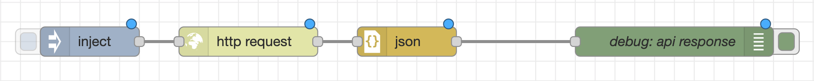

# Telegram Bot API Workshop

## Hinweise

- Die Lösungen der Aufgaben sind im [Repository](https://github.com/fheinrich03/iot_telegram_node_red_example) hinterlegt
	- die Flows können als Json Date importiert werden unter:
	- Menu -> Import -> Flow Json einfügen
- Da die Aufgaben aufeinander aufbauen, können die Lösungen für die Folgeaufgaben weiterverwendet werden

## Voraussetzungen

- Node-RED
- Telegram App auf Handy oder Laptop installiert
- Normaler Telegram-Account
- Telegram Nodes installiert: [node-red-contrib-telegrambot](https://flows.nodered.org/node/node-red-contrib-telegrambot)
	- Menu -> Palette verwalten -> Nodes installieren: `node-red-contrib-telegrambot`
	
---

## Aufgabe 1: Telegram Bot erstellen

1. Öffne die Telegram App (auf Handy oder Laptop)
2. Suche nach: `BotFather` und starte einen Chat
3. Erstelle einen neuen Bot mit `/newbot`
4. Wähle einen **Anzeigenamen** und einen **einmaligen** `bot_username`  
   (Der `bot_username` muss mit "bot" enden)
5. Speichere das ausgegebene **Token** für die folgenden Aufgaben

## Aufgabe 2: Bot API testen

1. Öffne die Telegram App (auf Handy oder Laptop)
2. Suche deinen Bot über deinen `<bot_username>` und starte einen Chat
3. Öffne den Browser und gib in die URL-Leiste ein:

   ```text
   https://api.telegram.org/bot<token>/getUpdates
   ```

   Ersetze `<token>` mit deinem **Token**.

4. Die Ausgabe sollte unter anderem `"ok": true` und eine `chatId` enthalten
5. Speichere die `chatId` für später

---

## Aufgabe 3: Einfache Telegram-Nachricht senden



### Nodes

- **Inject Node**

  - Der Payload kann _optional_ gelöscht werden, wird aber in der Function Node sowieso überschrieben

- **Function Node**

  ```javascript
  const telegramMessage = {
    chatId: 8286143389, // gib hier deine ChatId ein
    type: "message",
    content: "Hello World!",
  };

  msg.payload = telegramMessage;
  return msg;
  ```

- _Optional:_ Debug Node

- **Telegram Sender Node** (Installation: siehe Voraussetzungen)
  - Bot-Name: `<your_unique_bot_name>`
  - Bot-Token: `<your_bot_token>`

### Hinweise

- Stelle sicher, dass in der Function Node die `chatId` richtig gesetzt ist

### Ausführen

- **Deploy** nicht vergessen 😉
- **Inject Node** auslösen  
  → Erwartete Nachricht in Telegram: `Hello World!`

---

## Aufgabe 4: Wetter-Updates



Der Bot besteht aus 3 Teilen:

1. **Subscribe Handler**
2. **Wetter-Updates via HTTP erhalten**
3. **Nachrichten-Objekt bauen und senden**

Wir bauen den Bot in 3 Schritten auf.

---

### 4.1 Subscribe Handler



**Ziel:**

- User sendet `/startUpdates` → wird zu `flow.subscribers (array)` hinzugefügt
- User sendet `/stopUpdates` → wird aus `flow.subscribers (array)` entfernt

**Hinweis:**  
Statt Wetterdaten zu beziehen, verwenden wir zunächst einen **Inject Node**, um die `subscribers` im **Debug** auszugeben und an den Chat zurückzusenden.

#### Nodes

- **startUpdates – Telegram Command Node**

  - Bot-Name: `<your_unique_bot_name>`
  - Bot-Token: `<your_bot_token>`
  - Command: `/startUpdates`

- **stopUpdates – Telegram Command Node**

  - Bot-Name: `<your_unique_bot_name>`
  - Bot-Token: `<your_bot_token>`
  - Command: `/stopUpdates`

- **addSubscriber – Function Node**

  ```javascript
  let subscribers = flow.get("subscribers") || [];
  const currentChatId = msg.payload.chatId;

  // Subscriber hinzufügen
  if (!subscribers.includes(currentChatId)) {
    subscribers.push(currentChatId);
  }
  flow.set("subscribers", subscribers);
  // !! kein return msg; !!
  ```

- **removeSubscriber – Function Node**

  ```javascript
  let subscribers = flow.get("subscribers") || [];
  const currentChatId = msg.payload.chatId;

  // Chat-ID aus Liste filtern (löscht sie, falls vorhanden)
  subscribers = subscribers.filter((id) => id !== currentChatId);

  flow.set("subscribers", subscribers);
  // !! kein return msg; !!
  ```

- **showSubscribers – Function Node**

  ```javascript
  const subscribers = flow.get("subscribers") || [];
  const messageContent = "subscribed ChatIds: " + subscribers;

  const telegramMessage = {
    chatId: subscribers,
    type: "message",
    content: messageContent,
  };

  msg.payload = telegramMessage;
  return msg;
  ```

- **Telegram Sender – Telegram Sender Node**

  - Bot-Name: `<your_unique_bot_name>`
  - Bot-Token: `<your_bot_token>`

- **Init – Inject Node**
  - vorerst auf `manuell` belassen

#### Ausführen

- **Deploy** nicht vergessen 😉
- In der Telegram App an deinen Bot `/startUpdates` senden  
  → Erwartete Nachricht in Telegram: `subscribed ChatIds: 12345678`

---

### 4.2 Wetter-Updates via HTTP



**Ziel:**

- GET-Request an API-Endpoint von [Open-Meteo.com](https://open-meteo.com/)
- Response JSON parsen und in JavaScript-Objekt umwandeln
- Payload ausgeben und prüfen

#### Nodes

- **Init – Inject Node**
  - vorerst auf `manuell` belassen
- **httpGetWeather – HTTP Request Node**
  - URL: `https://api.open-meteo.com/v1/forecast?latitude=52.52&longitude=13.41&current_weather=true`
  - Method: `GET`
- **json – JSON Node**
- **debug – Debug Node**

#### Ausführen

- **Deploy** nicht vergessen 😉
- **Inject Node** auslösen  
  → Erwarteter Debug Output: JSON-Objekt mit Wetterdaten

---

### 4.3 Subflows verbinden und Wetter-Nachricht verfassen

**Ergebnis aus Aufgabe 4.2:**  


**Ergebnis aus Aufgabe 4.1:**  


**Ziel-Bot-System:**  


**Ziel:**  
Anstatt nur `subscribed ChatIds` zu senden, sollen relevante Wetterdaten gesendet werden.

#### Änderungen

- Verbinde die Subflows aus **Aufgabe 4.2** und **Aufgabe 4.1** wie im Bild _Ziel Bot System_ dargestellt.
- Ändere den **Inject Node** vor dem `http Node`, sodass er im Intervall **alle 5 Sekunden** auslöst.
- Ersetze die Funktion im Function Node `show subscribers` durch Folgendes:

  ```javascript
  const subscribers = flow.get("subscribers") || [];
  const weather = msg.payload.current_weather;

  if (!weather) {
    node.warn("Keine Wetterdaten gefunden");
    return null;
  }

  // Schönen Text für Telegram zusammenbauen
  const messageText =
    `🌤️ Wetter-Update für Berlin\n\n` +
    `🌡️ Temperatur: ${weather.temperature} °C\n` +
    `💨 Wind: ${weather.windspeed} km/h aus ${weather.winddirection}°\n` +
    `🕒 Zeit: ${weather.time.replace("T", " ")}`;

  const telegramMessage = {
    chatId: subscribers,
    type: "message",
    content: messageText,
  };

  msg.payload = telegramMessage;
  return msg;
  ```

#### Ausführen

- **Deploy** nicht vergessen 😉
- In der Telegram App an deinen Bot `/startUpdates` senden  
  → Erwartung: Alle **5 Sekunden** eine Nachricht mit Wetter-Updates
- In der Telegram App an deinen Bot `/stopUpdates` senden  
  → Erwartung: Keine weiteren Updates
